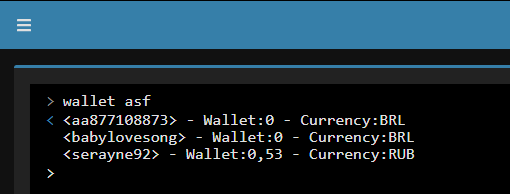

# GetBotsWallet
Simple plugin for [ArchiSteamFarm](https://github.com/JustArchiNET/ArchiSteamFarm) v5.1.0.9 or higher that checks balance on all bots.

ATTENTION: this is an example plugin made by me, I am studying the creation of plugins for ArchiSteamFarm, I don't recommend you to use this plugin, use the native function of ArchiSteamFarm

native function command "balance {BotName}" or "balance asf" to see the balance of all bots.
---
# How to use
Just Run the command: "wallet {BotName}" or "wallet asf" to see the balance of all bots.

